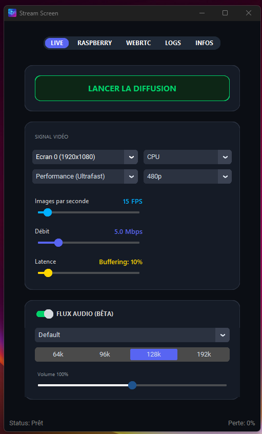
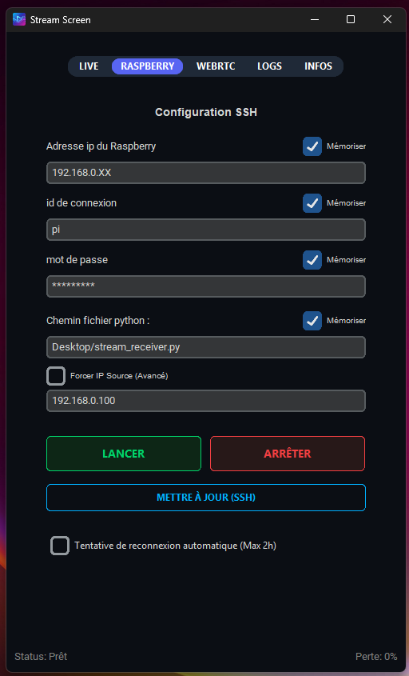

# Stream Screen

<p align="center">
  
  
</p>

### Haute Performance. Latence Zéro.
**Solution de streaming de bureau Windows vers Raspberry Pi.**

---

## Vue d'ensemble

**Stream Screen** n'est pas un simple partage d'écran. C'est un moteur de streaming optimisé, conçu pour transformer n'importe quel moniteur (physique ou virtuel) en flux vidéo **H.264** fluide et réactif via votre réseau local.

Contrairement aux solutions classiques (VNC, MJPEG), Stream Screen exploite l'accélération matérielle **NVENC/AMF** de votre carte graphique et le protocole **UDP** pour garantir une expérience sans-fil proche du câble HDMI.

## Fonctionnalités Clés

*   **Architecture "Zero-Copy"** : Capture DXCam directe vers Encodeur GPU.
*   **Encodage H.264 Hardware** : Compatible NVIDIA (NVENC) et AMD (AMF).
*   **Smart Refresh (Nouveau)** : Déduplication d'images (0% bande passante sur écrans statiques).
*   **Contrôle CPU Nul** : L'ordinateur reste 100% disponible (Priorité Haute).
*   **Déploiement SSH** : Pilotez le Raspberry Pi à distance directement depuis l'interface Windows.
*   **Intelligent** : Adaptation dynamique du bitrate et curseur selon la résolution.
*   **Monitoring** : Compteur de pertes en temps réel (%) et graphiques de latence.
## Options & Réglages

L'application offre un contrôle total sur le flux :

*   **Résolution** : De 360p à 4K. L'image est redimensionnée ("downscale") avant l'envoi pour économiser la bande passante, puis remise à l'échelle ("upscale") sur le Pi.
*   **Architecture** :
    *   **GPU (NVIDIA)** : Utilise NVENC. Ultra-rapide. Zéro charge CPU.
    *   **CPU (Compatibility)** : Utilise x264. Compatible tout PC.
*   **FPS (5 - 120)** : Ajustez la fluidité selon votre réseau.
*   **Bitrate (0.1 - 25 Mbps)** : Contrôlez la qualité d'image. Pour le Wifi, 5-8 Mbps est recommandé.
*   **Latence (Slider)** : Compromis entre réactivité et fluidité.
    *   **10-20%** : Mode "Haoe Fréquence" (Gaming/Bureau).
    *   **50%+** : Mode "Tampon" (Films/Vidéos) pour absorber les saccades réseau.
*   **Smart Refresh** : Si l'image est statique, le débit tombe à 0. Un "heartbeat" est envoyé toutes les 0.5s pour maintenir la connexion.

## Mise en Route

### Prérequis
*   **Émetteur** : Windows 10/11 avec GPU dédié (recommandé).
*   **Récepteur** : Raspberry Pi 3/4/5 (ou tout système Linux avec Python 3).

### Installation sur Raspberry Pi (Récepteur)

Exécutez les commandes suivantes dans votre terminal pour préparer l'environnement nécessaire au décodage H.264 :

```bash
# 1. Mise à jour des paquets
sudo apt update

# 2. Installation des dépendances système (requises pour PyAV)
sudo apt install -y python3-dev python3-pip libavformat-dev libavcodec-dev libavdevice-dev libavutil-dev libswscale-dev libswresample-dev libavfilter-dev

# 3. Installation des librairies Python
pip3 install av pygame
```

Une fois terminé, copiez simplement le fichier `stream_receiver.py` sur le bureau du Raspberry Pi.

### Lancement Manuel (Raspberry Pi)

Si vous ne souhaitez pas utiliser le lancement SSH automatique, vous pouvez lancer le récepteur manuellement :

```bash
# Lancer le récepteur
python3 stream_receiver.py
```

### Utilisation Rapide
1.  Ouvrez l'application sur Windows (`start.bat`).
2.  Renseignez l'IP de votre Raspberry Pi dans l'onglet dédié.
3.  Cliquez sur **"Lancer Receiver sur Pi"**. Le flux démarre instantanément.

---

## Stack Technique

*   **Core** : Python 3.11
*   **Capture** : DXCam (DirectX Mirror Driver) / MSS
*   **Encodage** : PyAV (FFmpeg Wrapper) -> NVENC H.264
*   **Réseau** : Sockets Raw (TCP/UDP Hybride)
*   **UI** : CustomTkinter

---

### Auteurs & Licence

**Mister Obat** — Conception & Développement
*Avec l'assistance technique de l'IA Google DeepMind.*

Licence **AGPL-3.0**. Usage personnel libre.